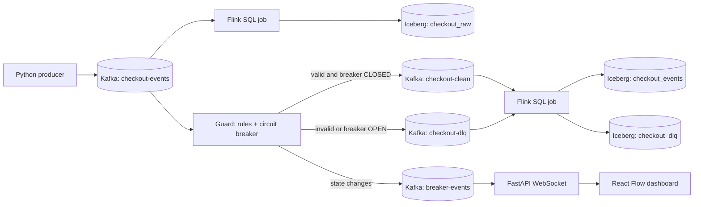

# Data flow

```mermaid
flowchart LR
  P[Python producer] --> K1[(Kafka: checkout-events)]
  K1 --> F1[Flink SQL job] --> R[(Iceberg: checkout_raw)]
  K1 --> G[Guard: rules + circuit breaker]
  G -->|valid and breaker CLOSED| K2[(Kafka: checkout-clean)]
  G -->|invalid or breaker OPEN| K3[(Kafka: checkout-dlq)]
  K2 --> F2[Flink SQL job] --> E[(Iceberg: checkout_events)]
  K3 --> F2 --> D[(Iceberg: checkout_dlq)]
  G -->|state changes| K4[(Kafka: breaker-events)]
  K4 --> A[FastAPI WebSocket] --> UI[React Flow dashboard]
```